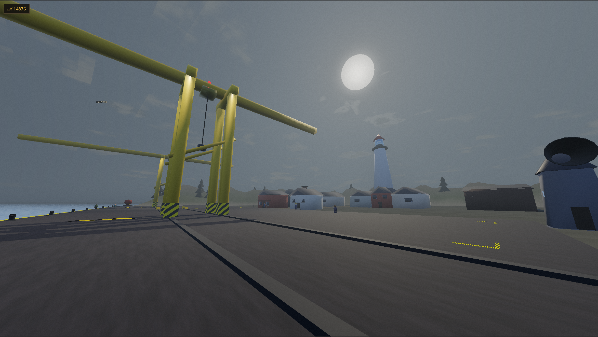
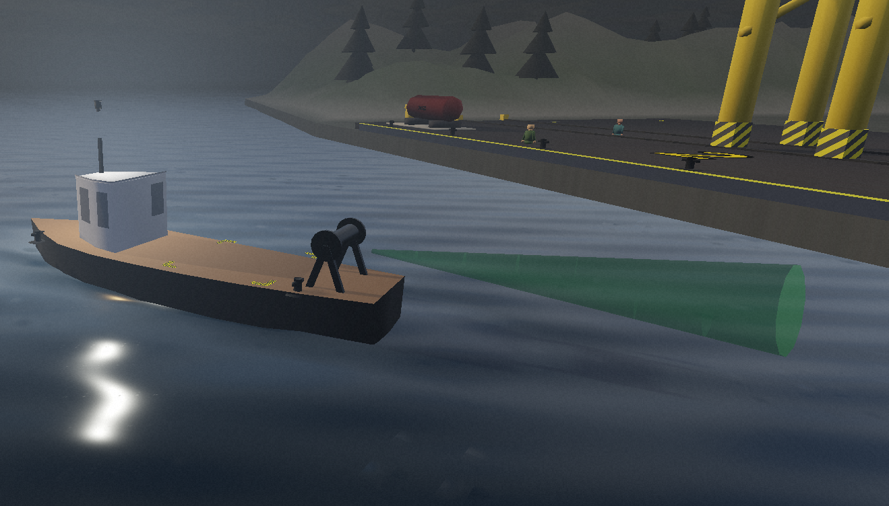
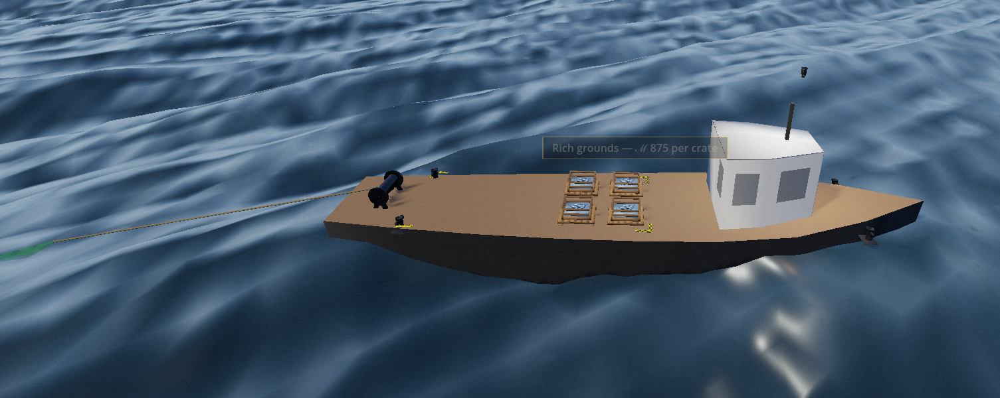
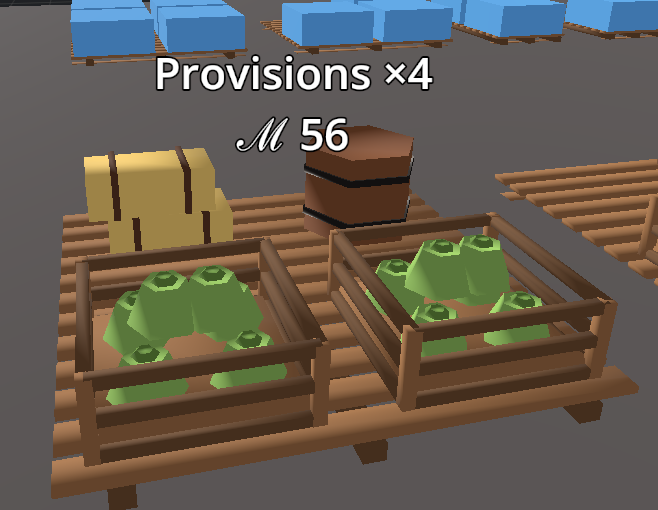
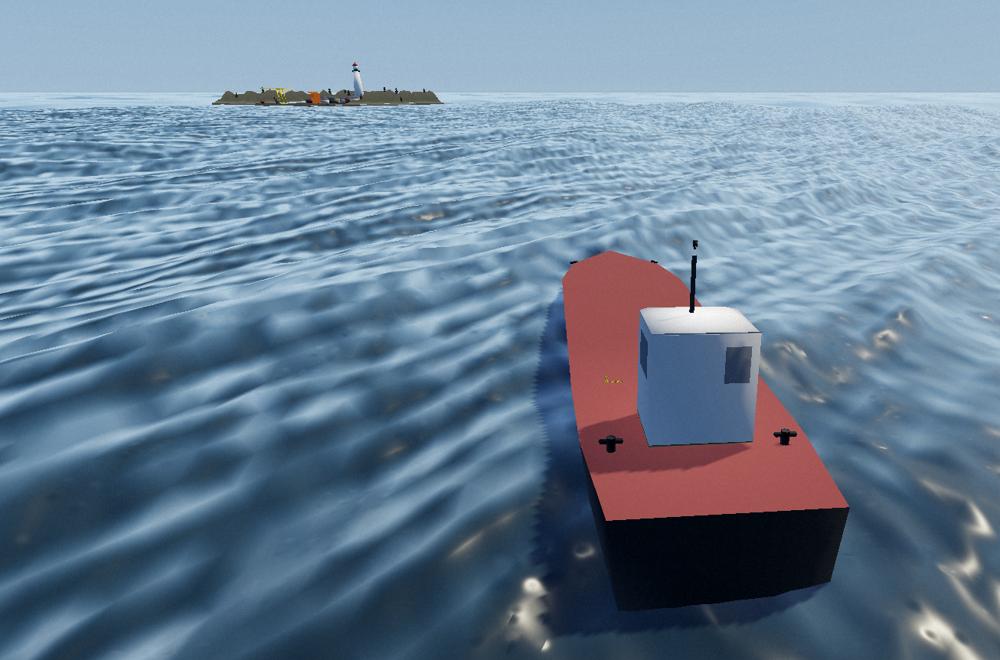
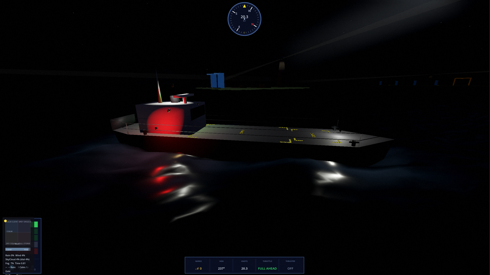

# Angst 'n Anchors

**A multiplayer maritime sandbox.** Commission vessels, haul cargo between ports, trawl for fish, operate gantry cranes, and grow a fleet on a shared ocean.



| | |
|:---:|:---:|
|  |  |
|  |  |



## About

Angst 'n Anchors is a physics-driven boating game built in **Godot 4.6**. Sail a procedurally generated archipelago of ports, earn your keep as a captain, and expand from a single trawler into a working fleet. Multiplayer runs on a dedicated [Go server](https://github.com/noahssjursen-code/angst-n-anchors-mp-server) with custom UDP replication.

## Gameplay

Visit the **Shipwright** to commission a vessel, request a berth from the **Harbour Master**, and take the helm.

- **Fishing** — deploy the trawl net, haul crates aboard, sell your catch at port
- **Cargo contracts** — accept a delivery, load pallets, sail the route, collect payment
- **Fleet ownership** — keep multiple hulls on the registry and deploy the one you need
- **Shared seas** — sail alongside other captains, share cranes, berths, and port traffic

Propulsion, rudder, bow thrusters, buoyancy, weather, fuel, and distance all matter. Driving the boat is the game.

## Features

- Modular ships assembled at runtime from data-driven hull templates
- FFT ocean with wave physics matched to the surface you see
- Seeded world with dozens of named ports, export stock, and contract boards
- Gantry cranes for loading and unloading cargo
- Persistent captains — money, fleet, cosmetics, and voyage progress
- Multiplayer built for density — 60-player proximity stress tests at ~740 kbps total throughput

## Devlog

- [Devlog 03](https://www.youtube.com/watch?v=NveSwPkEBd4)
- [Gameplay showcase](https://www.youtube.com/watch?v=FGHd4wTn02I&t=35s)

## Download & play

Requires **[Godot 4.6](https://godotengine.org/)** (Forward Plus, Jolt Physics). Windows / D3D12.

```bash
git clone https://github.com/noahssjursen-code/angst-n-anchors.git
cd angst-n-anchors
```

Open the project in Godot and press **F5**. Choose **Singleplayer** or **Multiplayer** from the main menu.

### Multiplayer

Clone and run the [multiplayer server](https://github.com/noahssjursen-code/angst-n-anchors-mp-server):

```bash
git clone https://github.com/noahssjursen-code/angst-n-anchors-mp-server.git
cd angst-n-anchors-mp-server
docker compose up --build
```

Default connection: `127.0.0.1:7777` (game) / `:8080` (HTTP). Configurable in the main menu.

## Controls

| Action | Key |
|--------|-----|
| Move | `W` `A` `S` `D` |
| Jump | `Space` |
| Sprint | `Shift` |
| Interact / board / helm | `F` |
| Toggle camera | `V` |
| Sea chart | `M` |
| Journal | `J` |
| Throttle ahead / astern | `W` / `S` |
| Rudder | `A` / `D` |
| Bow thrusters | `Q` / `E` |
| Thruster mode | `T` |
| Trawl net | `G` |

## License

Copyright © 2026 Noah Sjursen. All rights reserved.

This repository is **proprietary**. No use, copying, modification, or distribution is permitted without explicit written permission. See [LICENSE](LICENSE).
